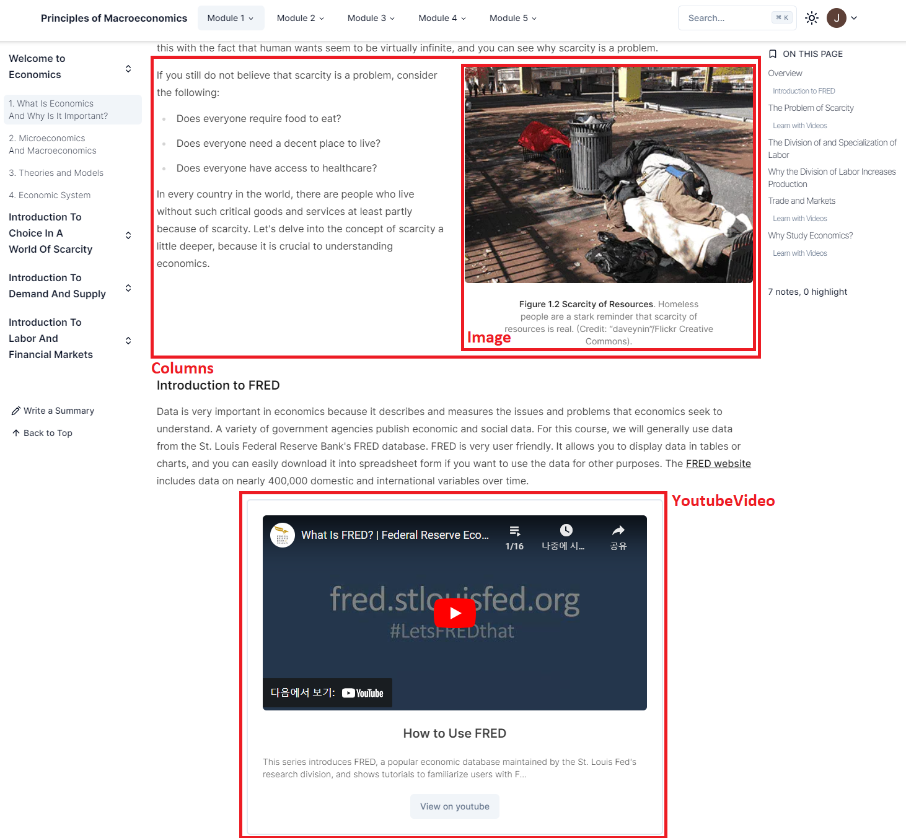
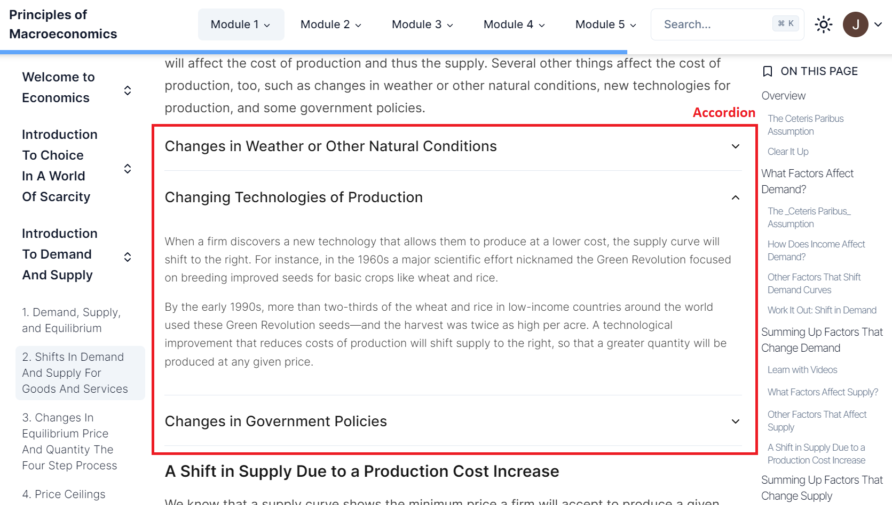
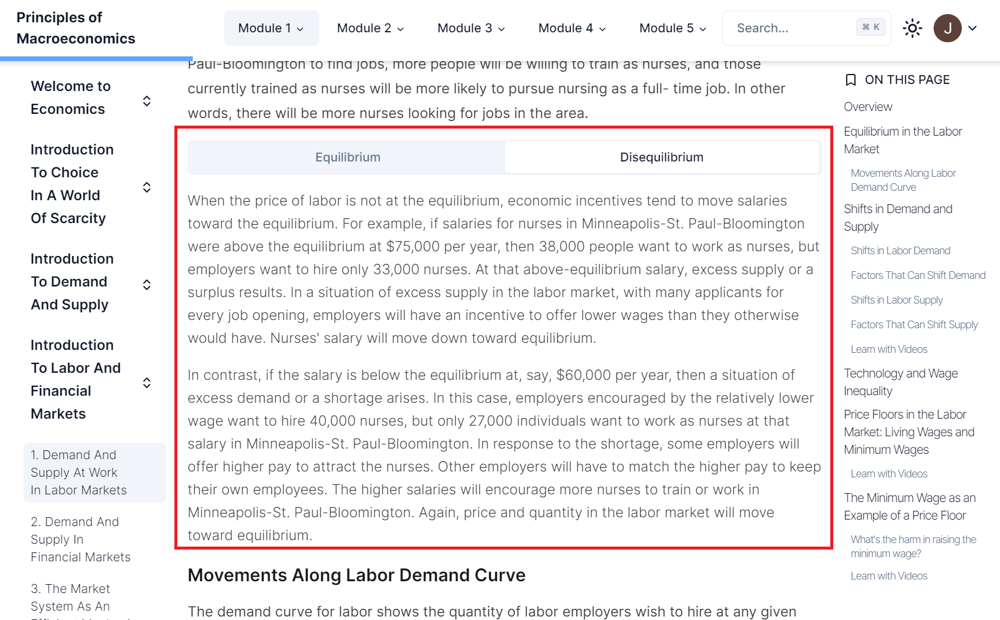

# Restructuring your Textbook for iTELL

## Modules, Chapters, Sections, and Subsections

```
└── Content/
    └── Section/
        ├── Module 1/
        │   ├── Chapter 1/
        │   │   ├── index.mdx
        │   │   ├── section-1.mdx
        │   │   └── ...
        │   ├── Chapter 2/
        │   │   ├── index.mdx
        │   │   ├── section-1.mdx
        │   │   └── ...
        │   └── ...
        ├── Module 2
        └── ...
```

iTELL expects text content to be provided using three separate levels: `Modules` (optional), `Chapters`, `Sections`, and `Subsections`. `Modules` are collections of `Chapters`, and `Chapters` collections of `Sections`. Each `Module` and `Chapter` are represented as subdirectories in the `content` folder. Each `Section` is located within a `Chapter` directory as a `.md` or `.mdx` file. `Subsections` are an organizational unit used by iTELL to divide up long sections. In a `Section` Markdown file, iTELL uses Markdown Level-1 and Level-2 headings to divide the text into meaningful units. `Subsections` work best when they are 200-400 words long (about 3 paragraphs). 

iTELL is in the process of developing a feature that will facilitate the restructuring of any textbook into these levels. Currently, the recommendation is that individual content developers restructure their textbook to these four levels using their own discretion and custom scripts.

## Content Authoring

After you divide your textbook contents into `Sections` and create the appropriate file structure for your textbook, the contents then have to be formatted in Markdown. You can use regular Markdown (`.md`), which is a simple and intuitive language for text formatting. If you want to customize the content and appearance further, you can also include Javascript in your Markdown files (`.mdx`). We have created some predefined JavaScript components to increase your textbook's interactivity.

### Markdown

#### Frontmatter

Each `Section` file should include a title card at the top, between two sets of three hyphens (---). This provides information about the `Section` page.
```
---
title: "What Is Economics And Why Is It Important?"
---
```

#### Headings
Headings are created with consecutive hash characters (#). iTELL uses Level-1 and Level-2 headings to divide the text into subsections. iTELL AI tools will ignore Level-3 and lower headings, but they can still be used to visually organize the text.
```
```
# H1
## H2
### H3
...
```
```

#### General Markdown Formatting
For Markdown formatting options that are not specific to iTELL, please refer to the following excellent guides: [Markdown Guide](https://www.markdownguide.org/basic-syntax/) and [Chicago Docs](https://kabartolo.github.io/chicago-docs-demo/docs/mdx-guide/writing/).

### Javascript
iTELL supports supports the use of custom Javascript components in MDX (`.mdx`) files. Below are some custom components that come prebuilt with iTELL.

#### Info and Callout


##### Info
```
<Info title="Title for info card">
"Your content"
</Info>
```
##### Callout
```
<Callout>
"Your content"
</Callout>
```

#### Columns, Image, and YoutubeVideo


##### Columns
```
<Columns>
  <Column>
    "Your column 1 content"
  </Column>
  <Column>
    "Your column 2 content"
  </Column>
  ...
</Columns>
```

##### Image
```
<Image
  src="Your image location"
  alt="Alternative information for your image"
>
  "Text explaining your image"
</Image>
```
##### YoutubeVideo
```
<YoutubeVideo
  width="Width value"
  height="Height value"
  src="Video source"
  title = "Your custom video title"
>
"Explanation of video content"
</YoutubeVideo>
```

#### Accordion and Tabs
##### Accordion

```
<Accordion>
  <AccordionItem value="Custom item value" title="Individual accordion item title">
      "Accordion content"
  </AccordionItem>
  <AccordionItem value="Custom item value 2" title="Individual accordion item title 2">
      "Accordion content 2"
  </AccordionItem>
  ...
</Accordion>
```

##### Tabs

```
<Tabs value="Default tab panel's value">
  <TabsHeader>
    <Tab value="1">"Tab 1 title"/Tab>
    <Tab value="2">"Tab 2 title"</Tab>
    <...>
  </TabsHeader>
  <TabsBody>
    <TabPanel value="1">
      "Tab 1 content"
    </TabPanel>
    <TabPanel value="2">
      "Tab 2 content"
    </TabPanel>
    ...
  </TabsBody>
</Tabs>
```

## Further customization
Refer to `packages/ui/src/components/callout.tsx` to find other custom components provided by iTELL. You can also use these as a reference for creating your own components!