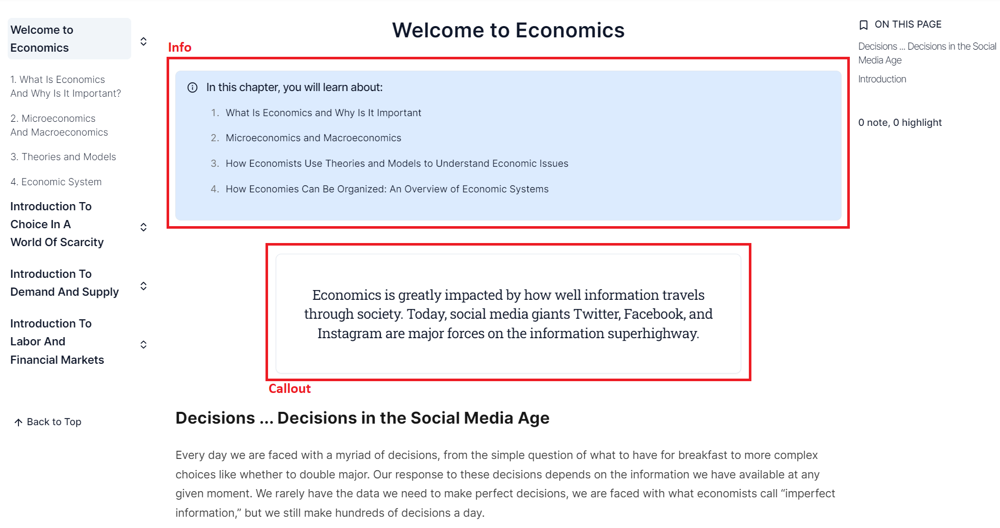

# Restructuring your Textbook for iTELL

## Modules, Chapters, Sections, and Subsections
```
└── Content/
    └── Section/
        ├── Module 1/
        │   ├── Chapter 1/
        │   │   ├── index.mdx
        │   │   ├── section-1.mdx
        │   │   └── ...
        │   ├── Chapter 2/
        │   │   ├── index.mdx
        │   │   ├── section-1.mdx
        │   │   └── ...
        │   └── ...
        ├── Module 2
        └── ...
```
iTELL expects text contents to be provided using three separate levels: `Modules`, `Chapters`, `Sections`, and `Subsections`. `Modules` are collections of `Chapters`, and `Chapters` collections of `Sections`. Each `Module` and `Chapter` are represented as subdirectories in the `content` folder. Each `Section` will live inside a corresponding `Chapter` directory as an `.mdx` file, and `Subsections` as components within the `Section` file.

iTELL is in the process of developing a feature that will facilitate the restructuring of any textbook into these levels. Currently, the recommendation is that individual content developers restructure their textbook to these four levels using their own discretion and custom scripts.


## MDX and JSX/TSX
After you divide your textbook contents into `Sections` and transfer them into individual MDX files, the contents then have to be reformatted following MDX syntax. You can use regular Markdown syntax and custom JSX/TSX components to increase your textbook's interactivity.

### MD
#### Frontmatter
Data about the `Section` should be included at the top of each MDX file between sets of three hyphens (---).
```
---
title: "What Is Economics And Why Is It Important?"
---
```

#### Headings
Headings are created with consecutive hash characters (#).
```
# H1
## H2
### H3
...

```

#### Lists
Unordered lists are created with asterisks and ordered lists with numbers followed by a period.
```
* unordered list item 1
* unordered list item 2

1. ordered list item 1
2. ordered list item 2
...
```

#### Links
Links are created by enclosing the link texts in square brackets and the URL in parantheses.
```
[Link text](https://www.yoururl.com)
```

#### Others
There are multiple great resources you can use as a reference when writing Markdown. Here is one by [Markdown Guide](https://www.markdownguide.org/basic-syntax/) and one by [Chicago Docs](https://kabartolo.github.io/chicago-docs-demo/docs/mdx-guide/writing/)


### JSX/TSX
MDX supports the use of custom JSX/TSX components. Below are some custom components that come prebuilt with iTELL.

#### Info and Callout

##### Info
```
<Info title="Title for info card">
"Your content"
</Info>
```
##### Callout
```
<Callout>
"Your content"
</Callout>
```

#### Columns, Image, and YoutubeVideo

##### Columns
```
<Columns>
  <Column>
    "Your column 1 content"
  </Column>
  <Column>
    "Your column 2 content"
  </Column>
  ...
</Columns>
```
##### Image
```
<Image
  src="Your image location"
  alt="Alternative information for your image"
>
  "Text explaining your image"
</Image>
```
##### YoutubeVideo
```
<YoutubeVideo
  width="Width value"
  height="Height value"
  src="Video source"
  title = "Your custom video title"
>
"Explanation of video content"
</YoutubeVideo>
```

#### Accordion and Tabs
##### Accordion

```
<Accordion>
  <AccordionItem value="Custom item value" title="Individual accordion item title">
      "Accordion content"
  </AccordionItem>
  <AccordionItem value="Custom item value 2" title="Individual accordion item title 2">
      "Accordion content 2"
  </AccordionItem>
  ...
</Accordion>
```

##### Tabs

```
<Tabs value="Default tab panel's value">
  <TabsHeader>
    <Tab value="1">"Tab 1 title"/Tab>
    <Tab value="2">"Tab 2 title"</Tab>
    <...>
  </TabsHeader>
  <TabsBody>
    <TabPanel value="1">
      "Tab 1 content"
    </TabPanel>
    <TabPanel value="2">
      "Tab 2 content"
    </TabPanel>
    ...
  </TabsBody>
</Tabs>
```

## Further customization
Refer to `packages/ui/src/components/callout.tsx` to find other custom components provided by iTELL. Also note that iTELL is completely open source and you can write your own components for further customization.


