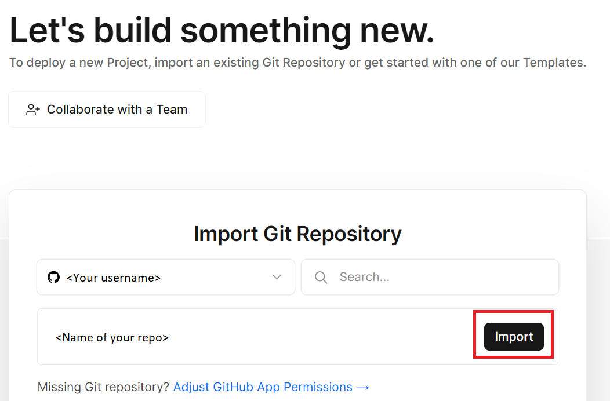
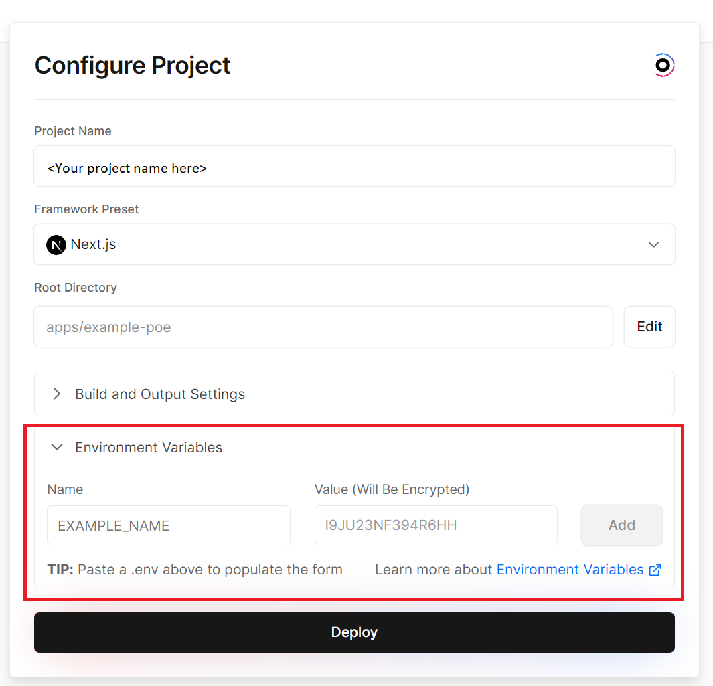
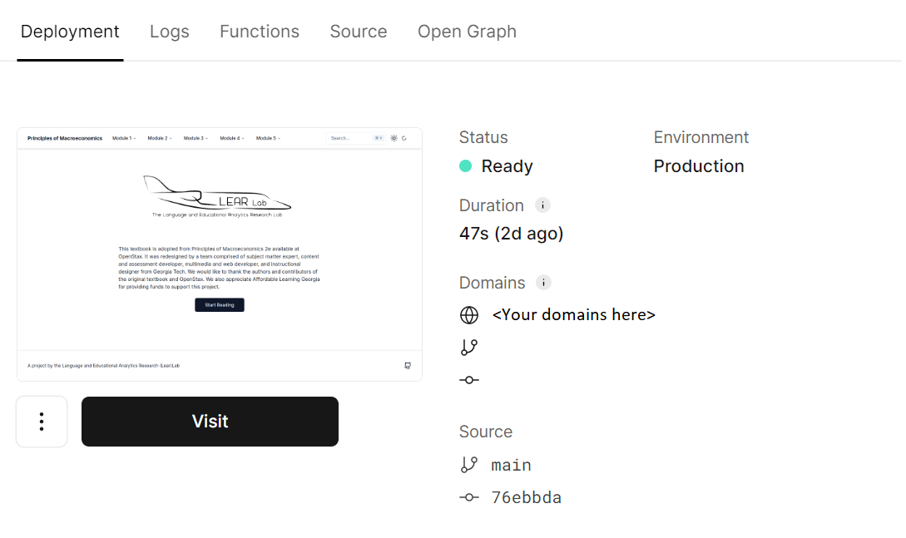

# Getting started

## Applications and Databases

iTELL requires the following applications and databases to be set up to function properly.

+ Frontend (NextJS): <https://github.com/learlab/itell>
+ Backend - scoring engine and API (FastAPI): <https://github.com/learlab/textbook-summary-api>
+ Database (Postgres)

In this tutorial, we will show you how to set up iTELL using some popular hosting services that have generous free tiers. You can also use your own hosting services of choice.

## Step 1. Set up a Postgres database

The default iTELL application uses [Supabase](https://supabase.com/). Migration will be handled by [Prisma](https://www.prisma.io/) as part of Step 3. All required files for the migration are included in [the prisma folder in the frontend application's Github repository](https://github.com/learlab/itell/tree/main/apps/example-poe/prisma).

## Step 2. Set up the Backend

iTELL uses an AI-powered scoring API to evaluate student writing. It was developed using Python's [FastAPI](https://fastapi.tiangolo.com/). You can use different setups and cloud services for local development and deployment, such as Google Cloud Run or Heroku. The API is packaged as a Docker container, so deployment is as easy as creating a `.env` file with information about your SupaBase database and deploying to a hosting service.

Documentation for the API is located at [the backend github repository](https://github.com/learlab/textbook-summary-api).

## Step 3. Deploy iTELL to Vercel

The default iTELL application uses [Vercel](https://vercel.com/). We will first go over the general setup requirements, and then we will provide a short example of what the deployment will look like when using Vercel.

### Environment variables

The following environment variables must be defined first
Set up [Google OAuth 2.0](https://developers.google.com/identity/protocols/oauth2) and [NextAuth](https://next-auth.js.org/) for user authentication.

```bash
GOOGLE_CLIENT_ID=<YOUR_GOOGLE_CLIENT_ID>
GOOGLE_CLIENT_SECRET=<YOUR_GOOGLE_CLIENT_SECRET>
NEXTAUTH_URL=<YOUR_BASEAPP_URL>
NEXTAUTH_SECRET=<YOUR_NEXTAUTH_SECRET>
DATABASE_URL=<YOUR_DATABASE_URI> # from Step 1
NEXT_PUBLIC_SCORE_API_URL=<YOUR_SCORE_API_ENDPOINT> # from Step 2
```

### Install packages, migrate data, and build

Install the required dependencies with pnpm, migrate the prisma schema after connecting your database, and build the web application:
```bash
pnpm install
npx prisma migrate dev --name init
turbo run build
```

### Example deployment: Vercel

Use Vercel to deploy a quick testable version of iTELL.

1. Create a Vercel account and connect your Github account to Vercel.
2. Fork the frontend repository.
3. Start a new Vercel project and import the frontend repo.

4. Specify environment variables (listed above) and hit deploy.

5. Confirm that your web application has been deployed.


Refer to [Vercel's documentation](https://vercel.com/docs/concepts/deployments/overview) for more information about deploying your webapp in Vercel.


