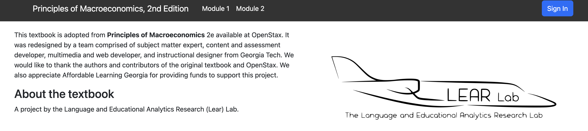

## Install node.js and yarn

Install node.js from <https://nodejs.org/en/>, then install yarn by running the following command in your terminal

```bash
npm install -g yarn
```


## Install packages

After cloning the textbook's repository, you can install all the dependencies for this project with yarn (see the previous section)

```bash
git clone https://github.com/aialoe/macro-economics-textbook
cd macro-economics-textbook
yarn install
```

## Start the server

After installation ends, verify your setup by running

```
yarn dev
```

It may take some minutes to start the project for the first time, if you see the following messages in the end it means things are working

```
success run static queries - 0.029s - 2/2 68.56/s
success run page queries - 0.009s - 3/3 319.64/s
⠀
You can now view principles-of-macroeconomics in the browser.
⠀
  http://localhost:8000/
⠀
View GraphiQL, an in-browser IDE, to explore your site's data and schema
⠀
  http://localhost:8000/___graphql
⠀
Note that the development build is not optimized.
To create a production build, use gatsby build
```

Finally, navigate to <http://localhost:8000/>, if everything is set up correctly you will see the textbook's homepage similar as what is shown below.

